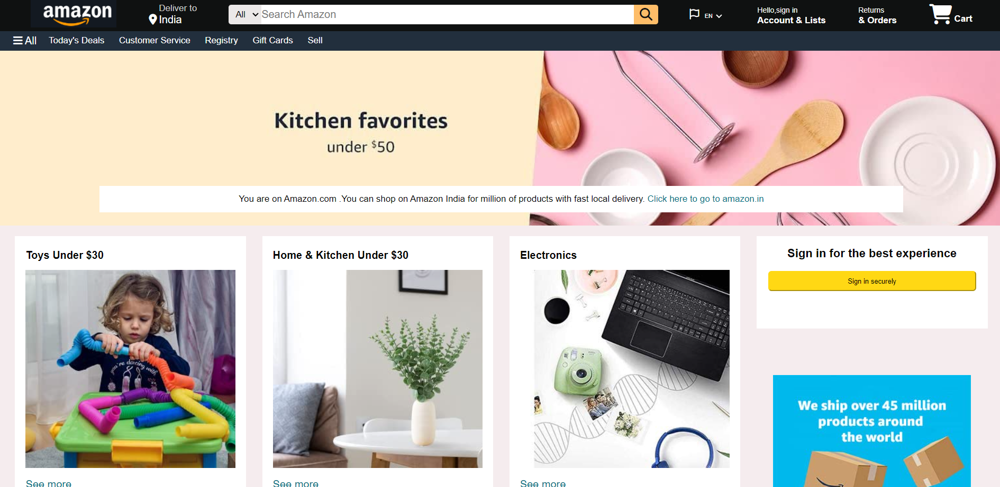
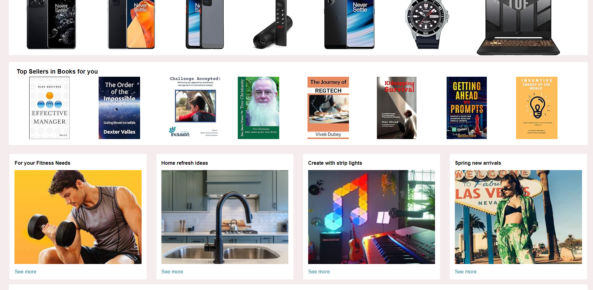
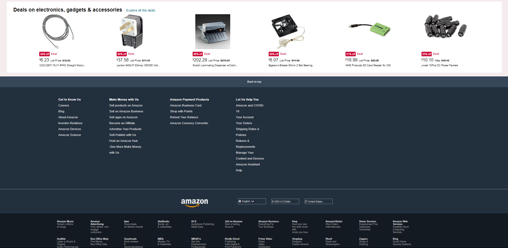

# Buyer: Amazon Clone

## Introduction

Buyer is a web application designed to mimic the design of Amazon. This project showcases the use of CSS for design and Font Awesome for icons to replicate Amazon's user interface. The focus is on creating a visually appealing and responsive design that closely resembles Amazon's website.


Here are some glimpses of the Buyer web application:

### Homepage



### Product Listings



### Footer



## Features

- **Homepage**: A visually appealing homepage with a navigation bar, search bar, and product listings.
- **Product Listings**: Display of products with images, titles, prices, and ratings.
- **Product Details**: Detailed view of each product including description and reviews.
- **Responsive Design**: Fully responsive design to ensure compatibility with various devices.

## Technologies Used

- **HTML**: For structuring the web pages.
- **CSS**: For styling and designing the user interface.
- **Font Awesome**: For incorporating a wide range of icons to enhance the visual appeal.

## Getting Started

### Prerequisites

To run this project locally, you need to have the following installed on your system:

- A web browser (e.g., Chrome, Firefox, Edge)

### Installation

1. Clone the repository to your local machine:

    ```bash
    https://github.com/Etika8445/Buyer.git
    ```
2. Open the `index.html` file in your web browser to view the application.


## Usage

1. **Homepage**: The homepage displays a navigation bar at the top, a search bar for searching products, and a list of product cards. Each product card shows an image, title, price, and rating.

2. **Product Listings**: Browse through different product categories to see a list of available products. Each product is displayed with relevant information and a link to its detailed view.

3. **Product Details**: Click on any product to view its details, including a larger image, detailed description, and customer reviews.

4. **Responsive Design**: The design is fully responsive and adjusts seamlessly to different screen sizes, ensuring a consistent user experience on desktops, tablets, and mobile devices.

## Acknowledgements

- [Amazon](https://www.amazon.com/) for the inspiration.
- [Font Awesome](https://fontawesome.com/) for the icons.
